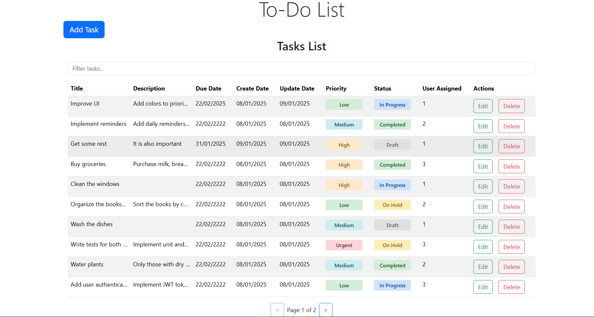

# Task Management App

Welcome to the Task Management App! This project provides a simple and interactive way to manage tasks. Below you'll find information on how to run, use, and understand the application.

---

## *How to Run*

1. Clone the project repository and navigate to the project directory.
2. Run the project using docker compose up.
    ```bash
    docker compose up
    ```
3. Open your browser and navigate to [http://localhost:3000](http://localhost:3000).

---

## *How to Use*

The app comes with preloaded tasks (some are marked as deleted) so you can explore its functionality:

### *Features:*

#### *Table Functionality:*
- *Filter:* Use the free text search box to filter tasks by "title" or "description."
- *Sort:* Click any table header to sort the tasks by that column.
- *Pagination:* The UI shows up to 10 tasks at a time. Use the pagination arrows to navigate between pages.

#### *Task Management:*
- *Create Task:* Click the *"Add Task"* button at the top left to create a new task.
- *Edit Task:* Click the *"Edit"* button in the actions column to update a task.
- *Delete Task:* Click the *"Delete"* button in the actions column to remove a task.

### *Input Restrictions:*
- *Due Date:* Must be from today onward.
- *User ID:* Must be a number.

Appropriate error messages will appear for invalid inputs.

---

## *Implementation Details*

### *Database:*
- Tasks are stored as individual files, with the task ID used as the filename.
- This structure allows for fast searching by ID.

### *Data Loading:*
- When the backend state is updated, the frontend reloads all tasks. 
- Although this approach may have performance implications, it ensures consistency between the backend and frontend, making it easier to maintain.

---

Enjoy exploring and managing your tasks with this app! 🚀